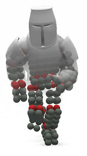

# Speck

This is implementation of my Master Thesis that later resulted in a paper for Eurographics 2018.

Paper link:

https://diglib.eg.org/handle/10.2312/egs20181031

Paper abstract:

In this paper, we propose a physically-based method for a rigid body joint simulation. The proposed solution is based on the unified particle physics engine, a simulator that uses only particles for all the dynamic bodies. Such engines are implemented on the GPU and they simulate fluids, rigid bodies or deform-able materials like cloth or ropes. To support more complex systems like skeletal simulation, we show a joint implementation that is intuitive and unique to this environment. Four types of joints will be shown, as well as the necessary details about the rigid body data structure. This will enable the construction of a popular method called ragdoll. Lastly, a performance measurement and a comparison with alternatives will be given.

--------------------------------------------------------------------

Requirements: 
- Directx12 compatible graphics card
- Windows 10 operating system

Recommended IDE:
- VS2017

Technologies used:
- Directx 12 API
